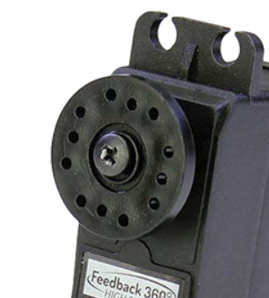
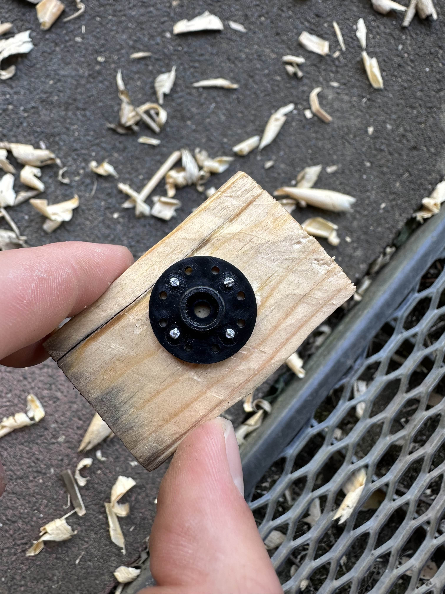

You can here see the standard connector that was shipped with the motor together. We first wanted to use the holes with bolts to connect it to our waterwheel. However after asking IDE students for bolts, it turned out that no bolts that Fontys possesses are small enough to fit trough these holes.

Now there were several suggestions of my team on how to solve this issue. From gluing it on, over screwing trough the plastic to just using the screw in the middle. 
I also had the idea to use nails, since they perfectly fit trough the holes and made a prototype:

However all these designs were in some way flawed, since the nails are hard to secure tight, gluing prevents replacing the wheel easily and screwing trough the plastic has the risk of breaking it. This worried us a lot, but luckily we got a different idea next week trough the feedback.

[go back](/doc/PersonalDevelopmentPlan.md)