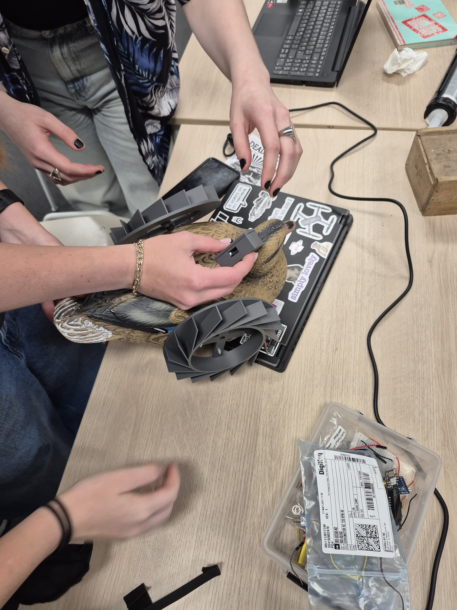

Here you can see us discussing how the distance sensor might be attached. They suggested putting it onto the duck sideways. We did not do it like that in the end, but it was still worth a consideration.

[go back](/doc/PersonalDevelopmentPlan.md)