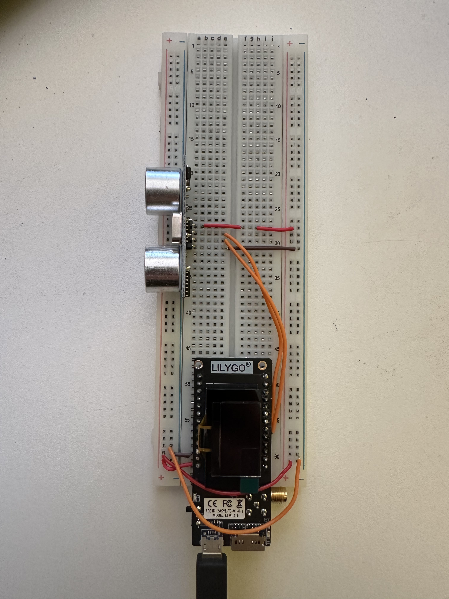
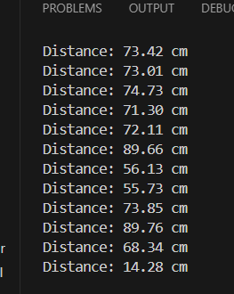

Here I just tried out the distance sensor, before integrating it into the whole system just so I can get familiar with how it operates:

And luckily it did work and actually displayed the distances:

[go back](/doc/PersonalDevelopmentPlan.md)