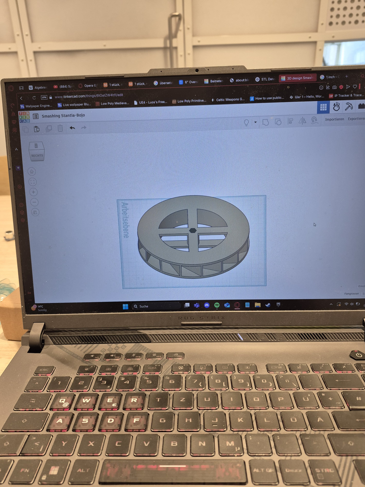
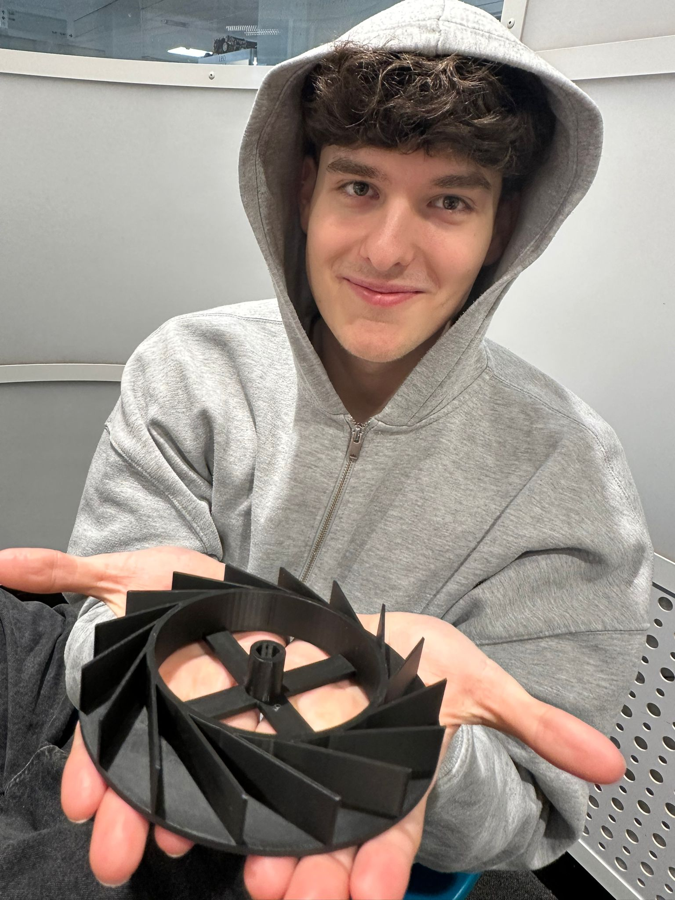

So the initial design for printing the waterwheels of the duck looked like that:

But after talking to the Green-Tech-Lab experts I learned that the models are not allowed to have overhang for 3D-printing. I was not aware of that previously and therefore we cut the wheel so the actual print then looked like this:

As you can see the top layer was cut out so that there is no overhang. This is less ideal, but a working compromise. The insight of the material and printing process helped greatly for printing all the other components.