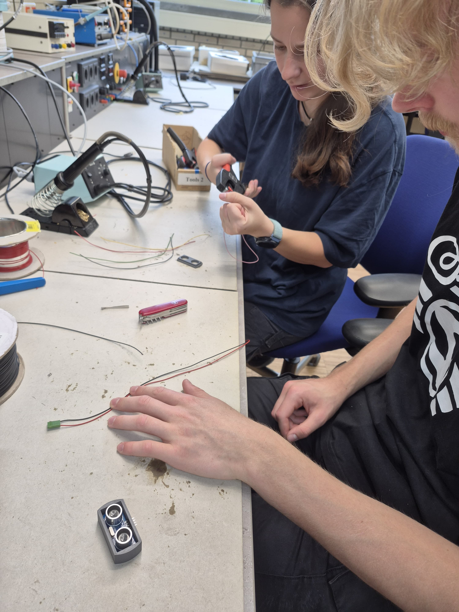

Here you can see an image of me and Alice attaching flexible cables to a housing. In this case it is to attach them to the distance sensor. The upside of flexible cables is that they do no break as easy as normal copper wire. We also got familiar with the tools that are needed to attach the wires.

[go back](/doc/PersonalDevelopmentPlan.md)