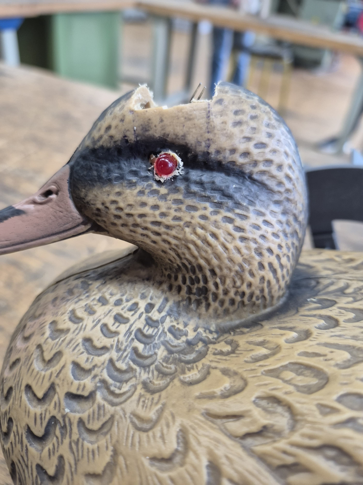
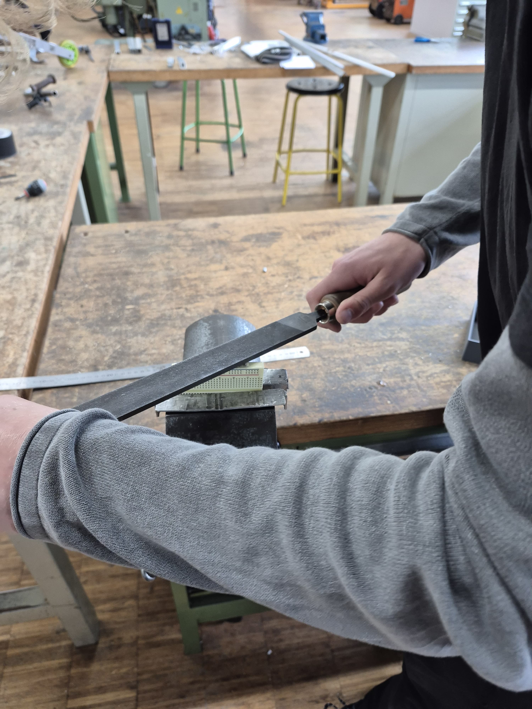
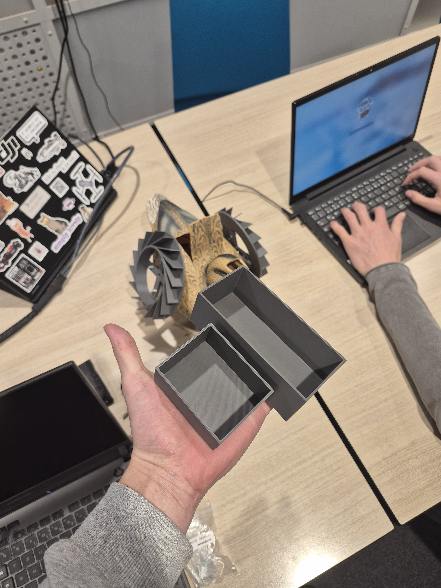

In this image I am drilling holes into the ducks eyes. And this is the final result:

Here I put red LED's in both eyes to later attach a PWM signal to so that the pulsate.
I also filed down the connectors of our small breadboard. Now it could not connect other breadboards anymore, but it fits into boxes that we have prepared for improved water-protection.

That is what the boxes look like:

[go back](/doc/PersonalDevelopmentPlan.md)