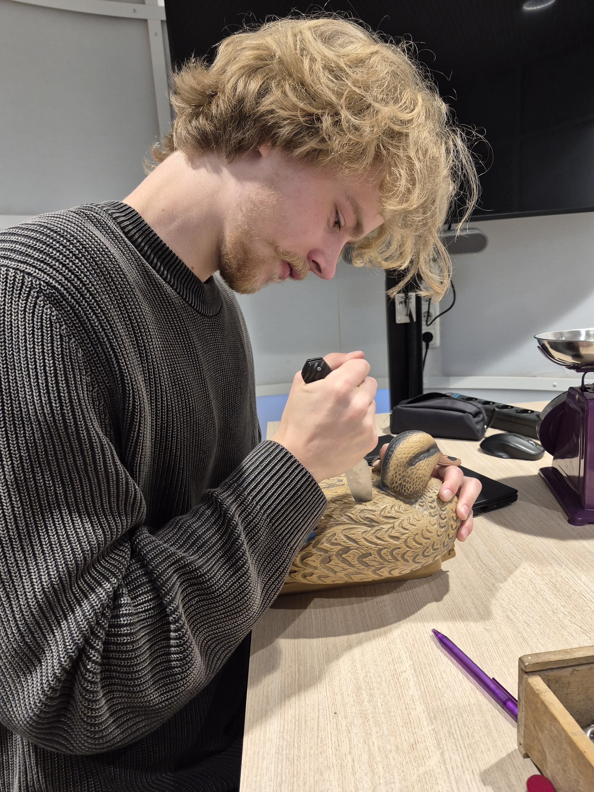
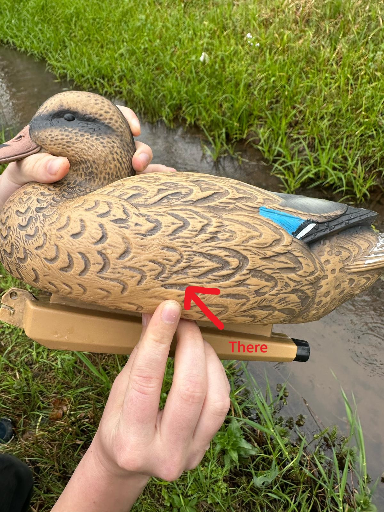

Here you can see me cutting the duck open and on the right is the scale that we measured the weight with.

And after testing it out in water it turned out that the waterline for the final duck will be approximately like shown in this image:

[go back](/doc/PersonalDevelopmentPlan.md)