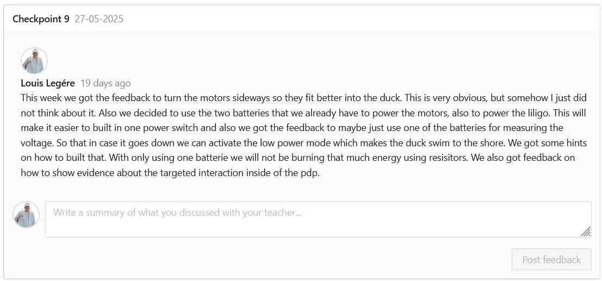

Even though this weeks feedback was to use both batteries meaning the two 3.7V batteries for the motors and the LiLiGo we decided to do it differently later. But both ways would have worked. But we did indeed use only one of the two batteries for measuring the voltage.

[go back](/doc/PersonalDevelopmentPlan.md)
