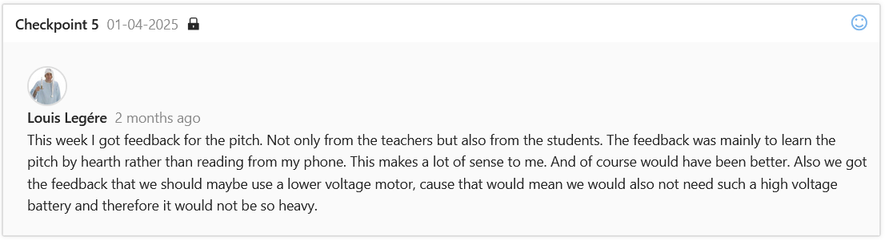

I got the feedback to speak more openly and therefore more directly to the audience. This makes a lot of sense and I learned out of that to prepare and practise my pitches before holding them.

My team also got the feedback to use lower voltage motors and therefore also batteries. We initially wanted to use a 12V motor and therefore also a 12V battery. Since this was our first project me and my teammates did not know what kind of motor is sufficient for the job. However after talking to Mr. Eric Peters together with Mr. van Gennip we decided for a lower voltage motor and battery, which turned out beneficial since keeping the duck-robot as waterproof as possible turned out to be quite a big challenge later on in development.

[go back](/doc/PersonalDevelopmentPlan.md)