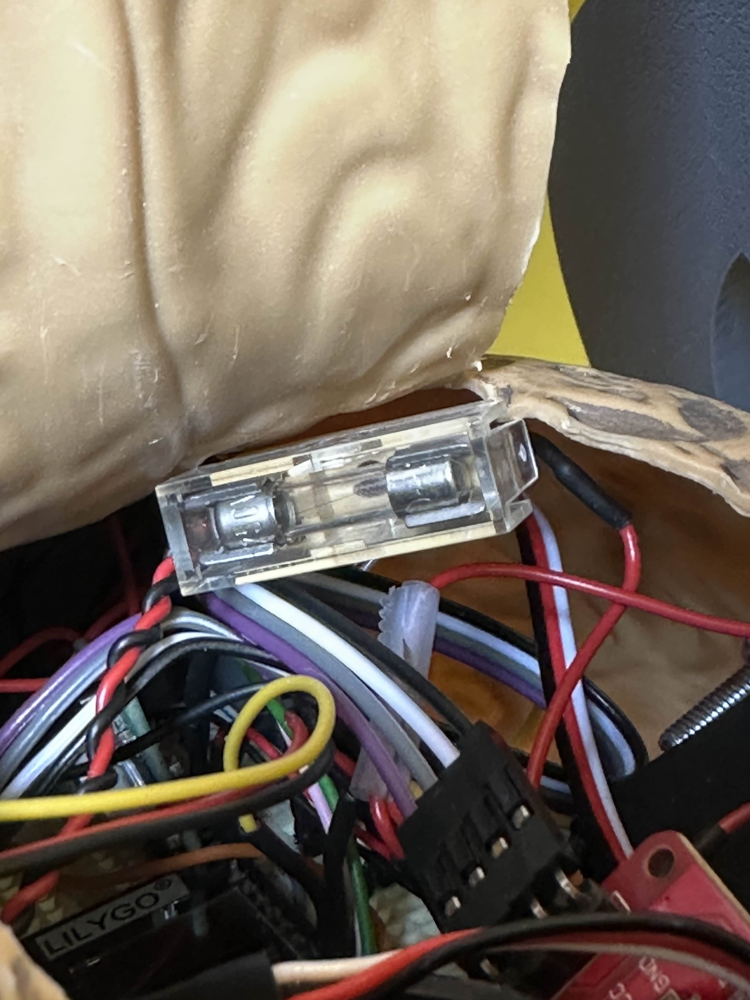

Here one of the fuses is visible. There are two in total. The one that is responsible for the circuit where the motors are attached is a slow fuse that does not break immediately when the current is to high for a short time and the other one is a fast fuse that does break immediately. To know what fuse to use I measured the current flowing in the circuit. We decided for a slow fuse for the motors, because here the current is more likely to change depending on the resistance against the motors.

[go back](/doc/PersonalDevelopmentPlan.md)