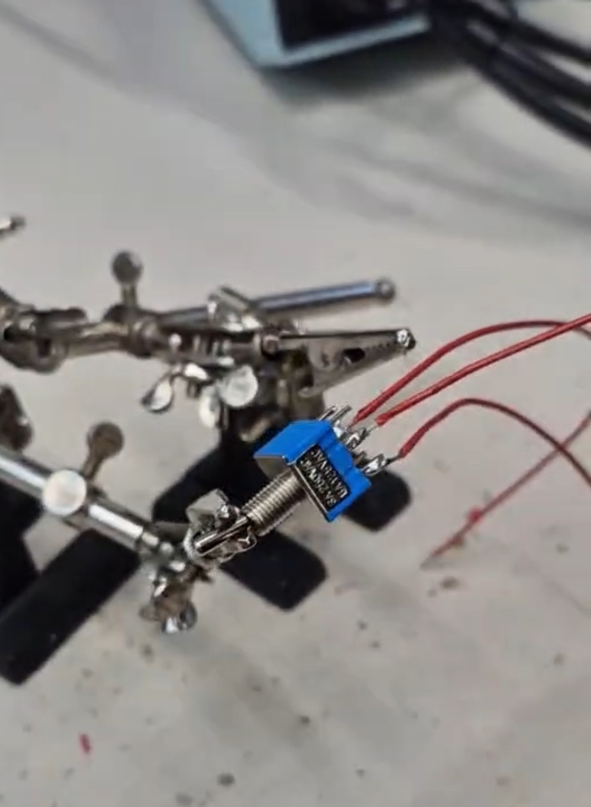

Here you can see how I soldered the switch to the wires. This one was not easy since I had to be careful that I do not unintentionally connect two pins and that the pins do not get too hot. However I succeeded.

[go back](/doc/PersonalDevelopmentPlan.md)