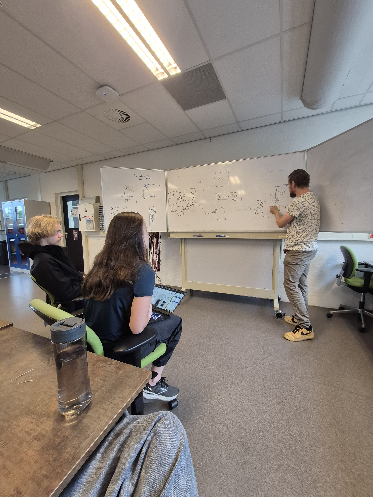

Here you can see me and Alice learning more about the resistor values in the voltage divider from Mr. Tange:

We actually did manage to use it in the end, even though I do not talk much about it in LO1 of the PDP. But that is because I was not much involved in actually building it physically, but rather planning and understanding it.

[go back](/doc/PersonalDevelopmentPlan.md)