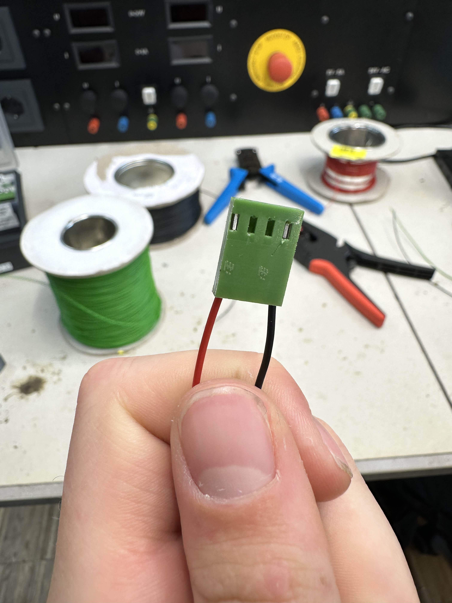

When we went to Mr. Eric Peters he told us that the cables we were using were wrong. He explained us the difference between flexible cables and normal cables. It turned out that flexible cables do not break as easy as normal cables and that we can use a housing to connect it to the distance sensor. This helped immensely since we had a lot of issues with breaking cables up to this point.

In the image you can see a housing with two flexible cables already attached. Now to put flexible cables into the breadboard it turned out that the ends have to be twisted and tinned or soldered to a fitting pin.

[go back](/doc/PersonalDevelopmentPlan.md)